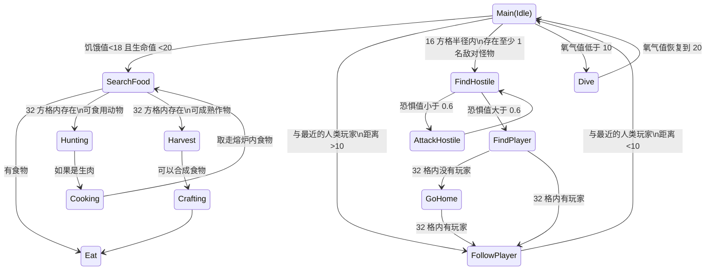

这是一个正在开发的Minecraft AI 机器人Koneko，使用有限状态机进行计算。

Node.js v20.17.0

```mermaid
stateDiagram


    Main(Idle) --> SearchFood: 饥饿值<18 且生命值 <20
    SearchFood  --> Eat: 有食物
    SearchFood --> Hunting: 32 方格内存在\n可食用动物
    Hunting --> Cooking: 如果是生肉
    Cooking --> SearchFood: 取走熔炉内食物
    SearchFood --> Harvest: 32 方格内存在\n可成熟作物
    Harvest --> Crafting: 可以合成食物
    Crafting --> Eat
    Main(Idle) --> FollowPlayer: 与最近的人类玩家\n距离 >10
    Main(Idle) --> FindHostile: 16 方格半径内\n存在至少 1 名敌对怪物
    FindHostile --> AttackHostile: 恐惧值小于 0.6
    AttackHostile --> FindHostile
    FindHostile --> FindPlayer: 恐惧值大于 0.6
    FindPlayer --> GoHome: 32 格内没有玩家
    FindPlayer --> FollowPlayer: 32 格内有玩家
    GoHome --> FollowPlayer: 32 格内有玩家
    FollowPlayer --> Main(Idle): 与最近的人类玩家\n距离 <10

    Main(Idle) --> Dive: 氧气值低于 10
    Dive --> Main(Idle): 氧气值恢复到 20
    
    
```