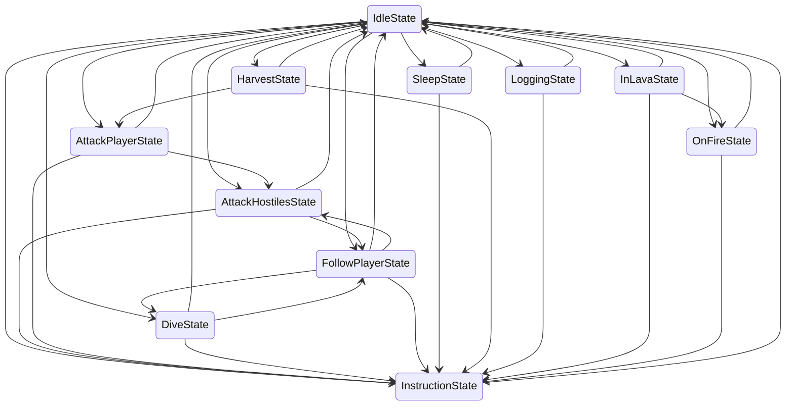

# Koneko Minecraft Bot

`KonekoMinecraftBot` is a Minecraft bot based on **Finite State Machine** and some **Machine Learning Algorithms**, such
as **DB-Scan** and **Single Layer Perceptron**.

> [!NOTE]
>
> This is the first release alpha version of `KonekoMinecraftBot`, some unexpected behaviours still exist, and may be fixed in later versions.
> Just think of your bot as a **Cute Neko Musume** to nurture but not a ~~Cold Dumb Machine~~ to oppress.

**TODO LIST**

- Implement more states: FishState, CollectDroppedItemsState, StorageState...
- Use neural network to remember the region of the player gathering place, structure of buildings, terrain around.
- Advanced cognitive-behavioral, may connect to Large Language Model.

## Koneko Finite State Machine

This state diagram show the relation between different states.
Each state $S$ has a transition value $T_S \ (0 \leq T_S \leq 1) $ denoted the probability of whether the FSM should
transition from current state to this state.
If the transition value of the current state is greater than any transition values of the next states of the current
state, FSM will not transition, or say **State Remain**.
Or else, it will transition to the state with maximum transition value, namely **State Transition**.

> Currently, FSM implementation does not really transition state on ~~probability distribution~~, but just on **value
comparison**, for development and test stability.
> I will test this trick in future releases, but using it or not depends on the final performance.

FSM updates transition values of all states registered per second (or 20 physical tick in Minecraft). If you think the
frequency is too low, just set a value you want.
But remember, some updates of transition value of specific states may depend on `EventEmitter` defined by
`KonekoMinecraftBot` and `mineflayer`, which are not fully controlled by FSM.
You should consider memory leak when implementing your custom states or FSM.

### State Diagram

> The state diagram is generated from source code.

### State Form

> The state form is generated from source code.

| State ID            | Description                                                                                                                                                                                          | Issues                                                                                                     |
|---------------------|------------------------------------------------------------------------------------------------------------------------------------------------------------------------------------------------------|------------------------------------------------------------------------------------------------------------|
| IdleState           | Do nothing. It is also an entry node for other states.                                                                                                                                               | -                                                                                                          |
| AttackHostilesState | Attack hostiles approaching robots.                                                                                                                                                                  | Probably not dodge from hostiles, but rather lunge aggressively                                            |
| AttackPlayerState   | Players who has maximum angry value will be attacked first. Player who has dead or has angry value below the threshold of attacking will be forgiven.All players will be forgiven when the bot dead. | -                                                                                                          |
| DiveState           | Bot should surface or sink if in water. Oxygen level and health are also considered.                                                                                                                 | It may also oscillate up and down in shallow water.                                                        |
| FollowPlayerState   | Follow the nearest player until the bot thinks it is close enough.                                                                                                                                   | -                                                                                                          |
| SleepState          | Based on information such as time and nearest bed, look for a bed to spend the night.                                                                                                                | Instead of going through the door, it is possible to enter the room in search of a bed by breaking blocks. |
| HarvestState        | If a player harvesting nearby, bot will also try to help harvest the crop.                                                                                                                           | -                                                                                                          |
| LoggingState        | If a player broke some log blocks nearby, bot will also try to help collect the wood with the axe equipped.                                                                                          | -                                                                                                          |
| InLavaState         | The robot panics in the lava and will randomly jump around.                                                                                                                                          | -                                                                                                          |
| OnFireState         | Bot is on fire or in fire, trying to touch the nearest water block.                                                                                                                                  | May take a very strange path to get close to the water block, resulting in being burned to death.          |
| InstructionState    | When the master chat a instruction keyword, try to execute this skill first.                                                                                                                         | -                                                                                                          |

### Some instructions

Chat with bot in Minecraft, the bot will prioritize the execution of your instruction.

> The instruction form is generated from source code.

| Instruction | Description                                                                                          |
|-------------|------------------------------------------------------------------------------------------------------|
| quit        | Ask bot to quit from the game. Usage: `quit`                                                         |
| stop        | Ask bot to stop current instruction executing. Note that it will not shutdown the FSM. Usage: `stop` |
| sow         | Ask bot to sow. Usage: `sow <item_name>`                                                             |
| harvest     | Ask bot to sow. Usage: `harvest`                                                                     |

## Machine Learning Algorithm

### DB-Scan

To search around log blocks and classify them as many clusters to identify the tree.

### Single Layer Perceptron

To consider as many as possible situations that affect the behaviours of bot, many weight parameters involved in the
calculation.
Most of the parameters can be adjusted manually because it has some interpretability.

## Q&A

### Supported Minecraft version

Only **Minecraft 1.20.1** has been tested now, I don't know whether other versions are supported or not.

You can download `registry_data.json` for your Minecraft version
and put it in `./resource/protocol/{VERSION}/register_data.json`. 
Update the version of `mineflayer` if you want higher version supported.

### Bot exited from game abnormally

Many situations will crash the bot, such as network connection or some bugs in code. 
You can create an issue if your problem can be reproduced.

### How can I implement my own FSM?

See `./src/fsm/impl` for more details.

## Licence

MIT

## Contact with Me

- Github: [AkagawaTsurunaki](https://github.com/AkagawaTsurunaki)
- Bilibili: [赤川鹤鸣_Channel](https://space.bilibili.com/1076299680)
- E-mail: [Outlook](AkagawaTsurunaki@outlook.com)