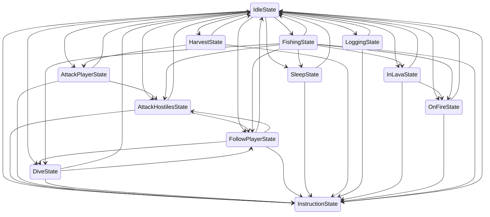

# Koneko Minecraft Bot


`KonekoMinecraftBot` is an intelligent Minecraft bot based on **Finite State Machine** and some **Machine Learning
Algorithms**, such
as **DB-Scan** and **Single Layer Perceptron**.

> [!NOTE]
>
> This is the first released alpha version of `KonekoMinecraftBot`, some unexpected behaviours still exist, and may be
> fixed in later versions (or not ///>_</// ).
> Just think of your bot as a **Cute Neko Musume** to nurture but not a ~~Cold Dumb Machine~~ to oppress.


> The logo and the illustration of Koneko are all designed by [AkagawaTsurunaki](https://github.com/AkagawaTsurunak).
> Doya?

## Features

- 🛡️ Protect players from being attacked by hostiles around.
- 👠 Follow players and move together.
- 🥕 Harvest corps and sow with players.
- 🪵 Collect woods with players.
- 🍽️ Automatically eat food when feeling hungry.
- 🛏️ Find the bed to sleep to spend the night.
- 💭 Follow some built-in instructions.
- 🏊🏻‍♀️ Swim or float to avoid drowning.
- 🔥 Look for water when on fire or after in lava.
- 😡 Attack the players who provoke it.
- 🧩 Implement your own skills, states, algorithms, FSM to create a bot!

**TODO LIST**

- Implement more states: FishState, CollectDroppedItemsState, StorageState...
- Use neural network to remember the region of the player gathering place, structure of buildings, terrain around...
- Advanced cognitive-behavioral, may connect to some Large Language Models.

## Get Started

### Prepare Your Minecraft

Download **Minecraft** in your computer and start the server.

Minecraft 1.20.1, 1.20.2 and 1.20.6 are supported.

> [!WARNING]
>
> To support other version of Minecraft, you should download `registry_data.json`
> from [here](https://wiki.vg/Registry_Data#Damage_Type) (click the link and scroll down to the bottom of page)
> and put the JSON file in `./resource/protocol/{VERSION}/register_data.json`.
> Then implement the code how process the `DamageEventEmitter` in this version.

### Download Dependencies

Suppose that **Node.js (20.17.0)** and **npm (10.8.2)** have been installed properly.

Use command

```shell
npm install
```

It will download all dependencies `KonekoMinecraftBot` need.

### Config Your Bot Option

Find the config file `./resource/config/botConfig.json` and edit it.

```json5
{
  "host": "127.0.0.1",
  // Minecraft server host. 
  "port": 25565,
  // Minecraft server port.
  "username": "Koneko",
  // Your bot name.
  "version": "1.20.1",
  // Minecraft version. Default to 1.20.1 if null is given.
  "masterName": "Akagawa"
  // The name of the master of your bot.
}
```

### Start!

Run the command.

```shell
npx tsx ./index.ts
```

Your bot will join the game later if everything goes well. Enjoy Minecraft time together!

## Finite State Machine

This state diagram show the relation between different states.
Each state $S$ has a transition value $T_S \ (0 \leq T_S \leq 1) $ denoted the probability of whether the FSM should
transition from current state to this state.
If the transition value of the current state is greater than any transition values of the next states of the current
state, FSM will not transition, or say **State Remain**.
Or else, it will transition to the state with maximum transition value, namely **State Transition**.

> Currently, FSM implementation does not really transition state on ~~probability distribution~~, but just on **value
comparison**, for development and test stability.
> I will test this trick in future releases, but using it or not depends on the final performance.

FSM updates transition values of all states registered per second (or 20 physical tick in Minecraft). If you think the
frequency is too low, just set a value you want.
But remember, some updates of transition value of specific states may depend on `EventEmitter` defined by
`KonekoMinecraftBot` and `mineflayer`, which are not fully controlled by FSM.
You should consider memory leak when implementing your custom states or FSM.

### State Diagram

Bot enter different states to take actions when specific condition held.

> The state diagram is generated from source code.



### State Form

The detail of all states are shown here.

> [!WARNING]
>
> Sometimes, bot will take weird or bad actions (break your house, dig a hole in your way, or trample your farmland).
> Therefore, please be careful when you are on a multiplayer server so as not to cause trouble to other players.

> The state form is generated from source code.

| State ID            | Description                                                                                                                                                                                          | Issues                                                                                                     |
|---------------------|------------------------------------------------------------------------------------------------------------------------------------------------------------------------------------------------------|------------------------------------------------------------------------------------------------------------|
| IdleState           | Do nothing. It is also an entry node for other states.                                                                                                                                               | -                                                                                                          |
| AttackHostilesState | Attack hostiles approaching robots.                                                                                                                                                                  | Probably not dodge from hostiles, but rather lunge aggressively                                            |
| AttackPlayerState   | Players who has maximum angry value will be attacked first. Player who has dead or has angry value below the threshold of attacking will be forgiven.All players will be forgiven when the bot dead. | -                                                                                                          |
| DiveState           | Bot should surface or sink if in water. Oxygen level and health are also considered.                                                                                                                 | It may also oscillate up and down in shallow water.                                                        |
| FollowPlayerState   | Follow the nearest player until the bot thinks it is close enough.                                                                                                                                   | -                                                                                                          |
| SleepState          | Based on information such as time and nearest bed, look for a bed to spend the night.                                                                                                                | Instead of going through the door, it is possible to enter the room in search of a bed by breaking blocks. |
| HarvestState        | If a player harvesting nearby, bot will also try to help harvest the crop.                                                                                                                           | -                                                                                                          |
| LoggingState        | If a player broke some log blocks nearby, bot will also try to help collect the wood with the axe equipped.                                                                                          | -                                                                                                          |
| InLavaState         | The robot panics in the lava and will randomly jump around.                                                                                                                                          | -                                                                                                          |
| OnFireState         | Bot is on fire or in fire, trying to touch the nearest water block.                                                                                                                                  | May take a very strange path to get close to the water block, resulting in being burned to death.          |
| InstructionState    | When the master chat a instruction keyword, try to execute this skill first.                                                                                                                         | -                                                                                                          |
| FishingState        | If bot has a fishing rod in the inventory and thinks it is close to a certain size of water, it will throw the rod tat where it is facing.                                                           | Bot may throw the fishing rod onto the surface of ground instead of the water.                             |

### Instructions

Chat with bot in Minecraft, the bot will prioritize the execution of your instruction.

> The instructions form is generated from source code.

| Instruction   | Description             | Usage                                                                                  |
|---------------|-------------------------|----------------------------------------------------------------------------------------|
| Quit Game     | quit                    | Ask bot to quit from the game.                                                         |
| Stop          | stop                    | Ask bot to stop current instruction executing. Note that it will not shutdown the FSM. |
| Sow Corps     | sow \<itemName:string\> | Ask bot to sow.                                                                        |
| Harvest Corps | harvest                 | Ask bot to harvest.                                                                    |

### Behaviours

Behaviors are usually not controlled by FSM and are autonomous and unconscious.
You are **UNABLE** to force the robot from taking these behaviours with instructions.

> The behaviours form is generated from source code.

| Name                       | Description                                                               |
|----------------------------|---------------------------------------------------------------------------|
| FaceToSoundSourceBehaviour | Bot will face to the sound source that made by players, hostiles or mobs. |
| AutoEatBehaviour           | Thanks to `mineflayer-auto-eat`, auto eat supported.                      |

## Machine Learning Algorithm

### DB-Scan

To search around log blocks and classify them as many clusters to identify the tree.

### Single Layer Perceptron

To consider as many as possible situations that affect the behaviours of bot, many weight parameters involved in the
calculation.
Most of the parameters can be adjusted manually because it has some interpretability.

## Q&A

### Bot can not join the game with no error shown

Player with the same name of your bot has joined the game, so your bot can not login.

### Bot joined, but can not move, even kill it

Some servers need a player to input your password. Login using Minecraft client and try again.

### Bot exited from game abnormally

Many situations will crash the bot, such as network connection or some bugs in my code.
You can create an issue if your problem can be reproduced.

### How can I implement my own FSM?

See `./src/fsm/impl` for more details.

## Licence

Feel free to create your own bot!

[Apache License - Version 2.0, January 2004](./LICENSE)

## Contact with Me

- Github: [AkagawaTsurunaki](https://github.com/AkagawaTsurunaki)
- Bilibili: [赤川鹤鸣_Channel](https://space.bilibili.com/1076299680)
- E-mail: [Outlook](AkagawaTsurunaki@outlook.com)